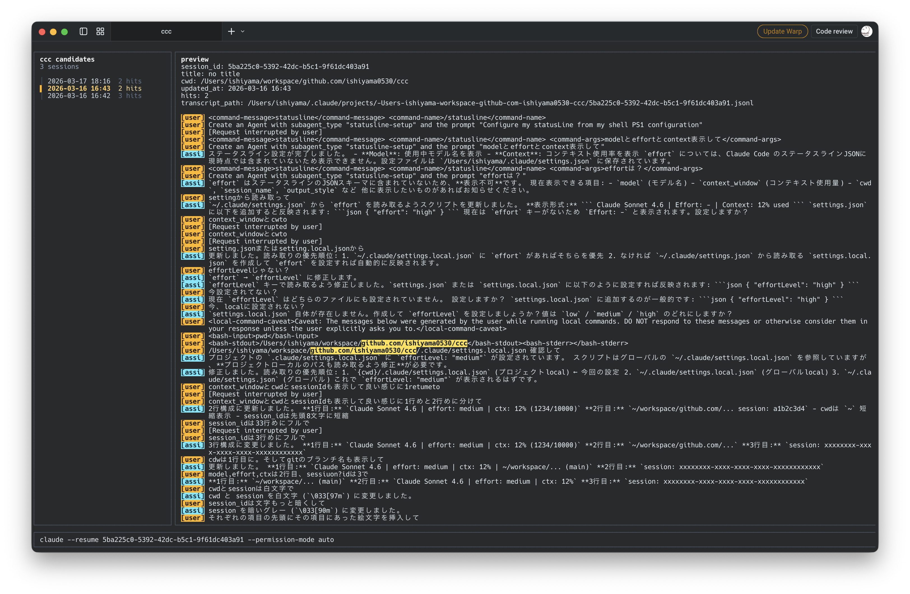

# ✨ # Claude Code Continue (ccc)

[English](./README.md) | [日本語](./README.ja.md)

> Claude Code の「あの会話どこだっけ？」を、数秒で終わらせるための CLI。

<p align="center">
  
</p>

`ccc` は、Claude Code の履歴から今ほしいセッションをすばやく見つけて、そのまま気持ちよく再開するための小さな CLI です。今いるプロジェクトにひもづく履歴を探してくれるので、「履歴を漁る時間」をかなり減らせます。

## 😩 なんで ccc が必要？

Claude Code を使い込むほど、セッション履歴はどんどん増えていきます。

つらいのは `claude --resume` そのものではなく、「再開したい会話を探し当てるまで」が地味に長いことです。

`ccc` はそこを楽にします。現在の作業ディレクトリに対応する Claude 履歴を絞り込み、内容をプレビューしながら、軽い TUI で迷わず再開できます。

## 🚀 クイックスタート

普段使いなら、まずはこれがおすすめです。

```bash
npm install -g @ishiyama0530/ccc
ccc
```

> 💡 継続的に使うなら `npm install -g @ishiyama0530/ccc` がいちばん快適です。入れてしまえば、あとは `ccc` だけで起動できます。

まずは試すだけでいいなら:

```bash
npx @ishiyama0530/ccc
```

GitHub Release から入れたい場合:

```bash
curl -fsSL https://raw.githubusercontent.com/ishiyama0530/ccc/main/install.sh | bash
```

- `npm install -g @ishiyama0530/ccc`: おすすめ。macOS / Linux / Windows の `amd64` / `arm64` に対応
- `npx @ishiyama0530/ccc`: まず触ってみたいとき向け。対応環境は npm install と同じ
- `curl -fsSL ... | bash`: macOS / Linux の `amd64` / `arm64` に対応。デフォルトでは `~/.local/bin` に `ccc` を入れます

シェルインストーラで保存先やバージョンを変えたい場合:

```bash
curl -fsSL https://raw.githubusercontent.com/ishiyama0530/ccc/main/install.sh | env CCC_INSTALL_DIR="$HOME/bin" bash
curl -fsSL https://raw.githubusercontent.com/ishiyama0530/ccc/main/install.sh | env CCC_INSTALL_VERSION=vX.Y.Z bash
```

## ❤️ 使いたくなるポイント

- ⚡ 目的の Claude セッションまで最短で戻れる
- 🎯 今いるプロジェクト基準で探すので、候補がちゃんと絞られる
- 👀 再開前に中身を見ながら確認できる

## 🧠 どう使う？

```bash
ccc
ccc bug
ccc -d ~/src/app timeout
ccc -n 200
```

- `ccc` をプロジェクトの中で実行します
- デフォルトでは、現在の作業ディレクトリに対応する Claude 履歴を検索します
- `-d` / `--dir` で別の作業ディレクトリを対象にできます
- `-n` / `--limit` で表示する履歴件数の上限を指定できます。デフォルトは `100`
- クエリなしなら、対象ディレクトリのセッション履歴を最大 `100` 件まで一覧表示します
- 検索は大文字小文字を区別しません
- 一致が見つかると TUI を開きます
- 下部のコマンドバーでは `claude --resume <session_id>` を固定したまま、追加の Claude 引数だけを足せます
- TTY なしで一致が見つかった場合はエラー終了します
- 0 件なら stderr にエラーを出して非 0 で終了します

## 💡 コマンド例

```bash
ccc
ccc -n 200
ccc bug
ccc -d ~/src/app
ccc -d ~/src/app -n 50 timeout
ccc --dir ~/src/app timeout
```

## ⌨️ キー操作

- `↑` / `↓`: 移動
- `Shift+↑` / `Shift+↓`: プレビューを 1 行ずつスクロール
- `Enter`: 選択したセッションを再開
- 文字入力: 追加引数を入力
- `Backspace`: 追加引数を編集
- `PgUp` / `PgDn`: プレビューをスクロール
- `Ctrl+U` / `Ctrl+D`: プレビューを速くスクロール
- `esc` / `ctrl+c`: 終了

## 🛠️ 開発

```bash
make build
make test
make lint
make run QUERY="bug"
# インストールせずにローカルの bin/ccc を一時的に実行
PATH="$PWD/bin:$PATH" ccc bug
```

## 📦 リリース

```bash
export GITHUB_TOKEN=...
export NPM_TOKEN=...
make release VERSION=vX.Y.Z
```

`make release` は、`install.sh` が使う GitHub Release を公開し、そのあと `@ishiyama0530/ccc` を npm に公開します。
